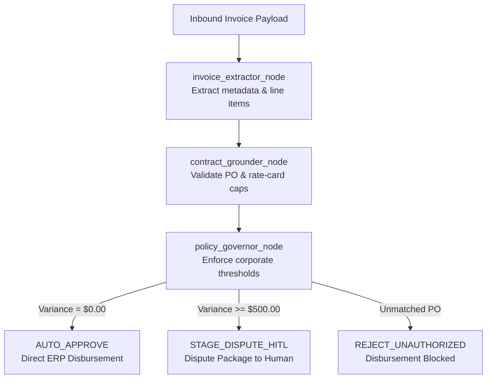

# VendorGuard AI — Enterprise Autonomous Invoice Reconciliation & Governance

VendorGuard AI is an autonomous, multi-agent financial compliance engine built natively on **Microsoft Azure AI Foundry Workflows**. It detects invoice rate creep, grounds claims against corporate rate cards and Purchase Orders, and deterministically triages payouts between straight-through processing and Human-in-the-Loop (HITL) dispute workflows.

---

## 1. Problem & Enterprise Impact

Enterprise procurement departments face systemic friction during multi-party vendor reconciliation:
- **Billing Leakage:** Discrepancies between approved contract rate caps and billed line items cost enterprises 3% to 7% of total procurement spend.
- **Manual Auditing Latency:** Procurement officers spend hours cross-referencing timesheets, service agreements, and ERP purchase orders.
- **Unverified Disbursements:** Invoices referencing retired, mismatched, or out-of-scope POs bypass standard AP checks.

VendorGuard AI solves this with a deterministic, multi-stage agent pipeline that audits, calculates variances, and enforces compliance policies before capital disbursement.

---

## 2. System Architecture

The reconciliation engine uses a 3-node sequential orchestration pattern on Azure AI Foundry:



---

## 3. Agent Topology & Configuration

| Node ID | Agent Name | Model Deployment | Core Responsibility |
| :--- | :--- | :--- | :--- |
| `invoice_extractor_node` | `invoice-extractor-agent` | `gpt-5-mini-1` | Ingests JSON invoice payloads, normalizes currency/totals, and structures line items for audit. |
| `contract_grounder_node` | `contract-grounding-agent` | `gpt-5-mini-1` | Audits billed unit rates against contracted rate cards; calculates per-item and total variances. |
| `policy_governor_node` | `policy-governor-agent` | `gpt-5-mini-1` | Enforces corporate thresholds and outputs deterministic actions and audit justifications. |

### Deterministic Governance Rules
- **Variance = $0.00 & Matched PO:** `AUTO_APPROVE` (`HITL: false`) — Straight-through disbursement.
- **Variance < $500.00:** `AUTO_ADJUST_TOLERANCE` (`HITL: false`) — Automated tolerance adjustment applied.
- **Variance >= $500.00:** `STAGE_DISPUTE_HITL` (`HITL: true`) — Staged for human review and dispute generation.
- **Unmatched PO / Unapproved Vendor:** `REJECT_UNAUTHORIZED` (`HITL: false`) — Disbursement blocked.

---

## 4. Verified Benchmark Scenarios

### Scenario A: Billing Discrepancy Flagged (`INV-102`)
- **Vendor:** Apex Cloud Consulting (`VEND-002`)
- **Purchase Order:** `PO-2026-9140` (Matched)
- **Findings:**
  - `CON-AI-01` (Principal AI Architect): Billed at **$260.00/hr** vs. Contract Cap of **$220.00/hr** across 40 hours.
  - Rate Overbilling: **+$1,600.00**.
  - `CON-DEV-02` (Senior Python Backend Engineer): Billed at **$130.00/hr** vs. Contract Cap of **$130.00/hr** (Compliant).
- **Verdict:** `STAGE_DISPUTE_HITL` (Variance exceeds $500 corporate threshold; flagged for Human sign-off).

### Scenario B: Clean Auto-Approval (`INV-101`)
- **Vendor:** CloudScale Logistics (`VEND-001`)
- **Purchase Order:** `PO-2026-8801` (Matched)
- **Findings:**
  - `SRV-LOG-01` (Standard Warehouse Routing): Billed at **$85.00/unit** vs. Contract Cap of **$85.00/unit**.
  - Rate Overbilling: **$0.00**.
- **Verdict:** `AUTO_APPROVE` (Straight-through AP execution; zero human overhead).

---

## 5. Enterprise Observability & Trace Telemetry

Telemetry is captured natively via Azure Application Insights inside the Azure AI Foundry portal:

| Trace Metric | Clean Run (`INV-101`) | Discrepancy Run (`INV-102`) |
| :--- | :--- | :--- |
| **Execution Status** | `Completed` | `Completed` |
| **Total Duration** | 14.957s | 20.224s |
| **Tokens (Input)** | 21,383 | 15,940 |
| **Tokens (Output)** | 1,050 | 1,722 |
| **Estimated Cost** | ₹0.68 | ₹0.68 |
| **Trace Drilldown** | Full multi-node span waterfall | Full multi-node span waterfall |

---

## 6. Repository Structure

```text
vendorguard-ai/
├── README.md                   # Enterprise architecture and telemetry documentation
├── vendorguard_workflow.yaml   # Exported Azure AI Foundry Workflow definition
├── workflow_runner.py          # Programmatic trigger script via Azure AI Agent Service
└── test_payloads.json          # Standardized evaluation test fixtures
```

---

## 7. Programmatic Execution

### Setup
```bash
pip install azure-ai-projects azure-identity
```

### Run
```bash
export PROJECT_CONNECTION_STRING="<your-foundry-connection-string>"
python workflow_runner.py
```